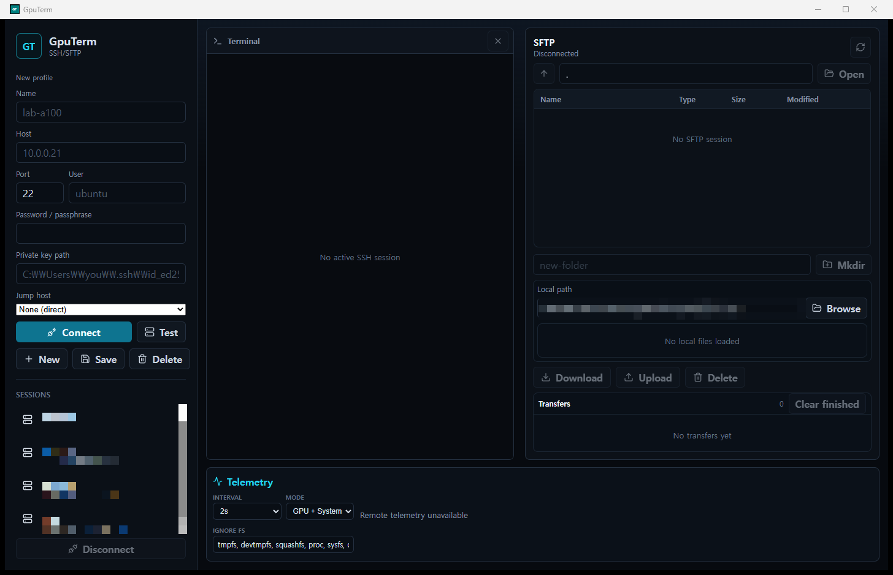

<div align="center">

# GpuTerm

**GPU 서버를 위한 올인원 SSH/SFTP 데스크톱 클라이언트.**

터미널, 파일 전송, 그리고 CPU · RAM · 디스크 · GPU(NVIDIA / AMD / Intel / Apple Silicon) 실시간 모니터링 — 하나의 네이티브 창에서.

[](https://github.com/fortranmentis/GPUTERM/releases)
[](https://github.com/fortranmentis/GPUTERM/actions/workflows/release.yml)
[](https://github.com/fortranmentis/GPUTERM/releases)
[](./LICENSE)
[](https://tauri.app)
[](https://react.dev)
[](https://www.rust-lang.org)

[English](./README.md) · [한국어](./README.ko.md)



</div>

---

원격 GPU 서버에서 작업하다 보면 SSH 클라이언트, SFTP 도구, 그리고 `watch nvidia-smi`를 띄워둔 터미널까지 세 개의 창을 오가게 됩니다. **GpuTerm은 이 셋을 하나로 합쳤습니다.** 한 번 접속하면 xterm.js 터미널, 드래그 앤 드롭 SFTP 브라우저, 그리고 CPU·메모리·디스크·로그인 사용자·GPU(NVIDIA·AMD·Intel·Apple Silicon, Linux/macOS/Windows 모두)를 폴링하는 실시간 텔레메트리 바가 함께 열립니다. 모니터링은 별도 SSH 채널로 동작하므로 셸 작업을 방해하지 않습니다.

서버에는 아무것도 설치하지 않습니다: 모든 지표는 표준 명령(`nvidia-smi`, `/proc`, `sysctl`, PowerShell CIM 등)을 SSH로 1회씩 실행해 수집하며, 핵심 지표에는 root/관리자 권한도 필요 없습니다.

> **상태:** 베타. 모든 [릴리스](https://github.com/fortranmentis/GPUTERM/releases)에 Windows·macOS·Linux 설치 파일이 첨부되며, 아래 안내에 따라 소스에서 직접 빌드할 수도 있습니다.

## 목차

- [주요 기능](#주요-기능)
- [모니터링 지원 범위](#모니터링-지원-범위)
- [설치](#설치)
- [사용법](#사용법)
- [아키텍처](#아키텍처)
- [개발](#개발)
- [FAQ](#faq)
- [문제 해결](#문제-해결)
- [로드맵 / 알려진 제한](#로드맵--알려진-제한)
- [라이선스](#라이선스)

## 주요 기능

### 🖥️ SSH 터미널
- [xterm.js](https://xtermjs.org)와 Rust [`ssh2`](https://crates.io/crates/ssh2) 기반의 완전한 PTY 터미널
- **다중 세션 동시 접속** — 세션마다 터미널·스크롤백·SFTP 경로를 독립적으로 유지하며, 사이드바에서 연결된 프로필을 클릭하면 전환
- **최대 4개의 유연한 터미널 셀** — 새 셸이나 다른 저장 세션을 포커스된 창의 왼쪽·오른쪽·위·아래에 배치하고, 초기 분할 비율을 고른 뒤 구분선을 드래그해 중첩 레이아웃 크기 조절
- **접을 수 있는 호스트 선택창** — 사이드바를 닫아 작업 공간을 넓히고 왼쪽 상단 버튼으로 다시 열 수 있음; 전체 프로필 입력란은 **New**에서만 표시되고 저장 세션은 접속 시 자격 증명만 입력
- **ProxyJump** — 저장된 프로필을 점프 호스트(bastion)로 지정해 경유 접속 (경유 구간마다 키 종류별 호스트 키 검증)
- 비밀번호, 개인키(패스프레이즈 포함), SSH 에이전트 인증 지원
- UTF-8 안전 스트리밍 — 청크 경계에 걸린 멀티바이트 문자(한글, 日本語, 이모지)가 깨지지 않음
- **한글 입력 정상 동작** — WebKit 계열 웹뷰의 자모 분리 버그를 네이티브 터미널과 같은 백스페이스-재작성 방식으로 해결해, 터미널에서 한글 IME 조합이 올바르게 처리됩니다
- MOTD를 포함한 접속 초기 출력을 버퍼링 후 재생 — 연결 타이밍에 유실되지 않음
- 원격 PTY 크기 자동 동기화 및 SSH keepalive

### 📁 SFTP 브라우저
- 원격/로컬 패널을 나란히 두고 드래그 앤 드롭으로 업로드·다운로드
- **데스크톱 파일 관리자에서 복사·붙여넣기 업로드** — Nautilus 등 URI 목록을 지원하는 파일 관리자에서 로컬 파일을 복사한 뒤 원격 패널에 붙여넣기
- 1 MiB 청크 스트리밍 전송, 진행률 큐, **파일별 전송 취소**
- 다운로드는 임시 파일에 쓴 뒤 원자적으로 교체 — 불완전한 파일이 남지 않음
- 덮어쓰기 확인, 삭제, 폴더 생성, OS 네이티브 폴더 선택기
- 터미널/SFTP 창 사이 너비 조절 스플리터 (재시작 후에도 유지)
- **접을 수 있는 SFTP 창** — 방향성 패널 버튼으로 닫고 오른쪽 상단에서 복원; 닫으면 터미널이 남은 가로 공간으로 즉시 확장

### 📊 실시간 텔레메트리
- 하단 상태바에서 CPU, RAM, 디스크, 로그인 사용자, GPU를 1~10초 주기로 폴링 — **Linux·macOS·Windows 원격 모두 지원**
- **접을 수 있는 모니터링 바** — 독립적으로 닫고 오른쪽 하단에서 복원할 수 있으며, 표시 상태를 재실행 후에도 유지
- **NVIDIA·AMD·Intel·Apple Silicon** GPU를 호스트별로 자동 감지하며, 카드마다 벤더 태그 표시
- **내장 + 외장 하이브리드 구성도 두 GPU 모두 표시** — Windows에서는 DirectX LUID로 카운터를 어댑터에 정확히 귀속시켜 내장 GPU가 외장으로 오인되지 않습니다
- 각 섹션을 클릭하면 표가 창 크기에 맞춰 확장되는 **드래그·크기 조절 가능 상세 팝오버**: 코어별 CPU 사용률, 상위 프로세스, GPU별 VRAM/전력/온도, 전체 마운트 목록
- **상세창을 별도 OS 창으로 분리** 가능 — 독립적으로 갱신되고 세션이 끊기면 함께 닫힘
- 텔레메트리는 세션별 전용 SSH 연결에서 동작하며 끊기면 지수 백오프로 자동 재연결
- GPU가 전혀 없는 서버에서는 시스템 지표만 표시하며 정상 동작

### 🔐 기본 보안
- 비밀번호는 메모리에서만 유지 — 디스크에 기록하지 않음
- 최초 접속 시 SHA-256 호스트 키 지문을 확인하는 TOFU 프롬프트, 지문 불일치 시 연결 차단
- 프로덕션·개발 창 모두에 제한적인 Tauri Content Security Policy 적용

## 모니터링 지원 범위

| 지표 | Linux | macOS (Apple Silicon) | Windows (OpenSSH Server) |
| --- | :-: | :-: | :-: |
| CPU 모델 · 코어 · 사용률 | ✅ | ✅ (P/E 코어 구성) | ✅ |
| Load average | ✅ | ✅ | — (Windows에 개념 없음) |
| 메모리 + 스왑 | ✅ | ✅ (활성 상태 보기 기준) | ✅ (페이지 파일을 스왑으로) |
| 디스크 / 마운트 | ✅ | ✅ | ✅ (고정 드라이브) |
| 로그인 사용자 | ✅ `who` | ✅ `who` | ✅ `quser` (Home 에디션 제외) |
| NVIDIA GPU (사용률·VRAM·전력·온도·프로세스) | ✅ `nvidia-smi` | — | ✅ `nvidia-smi` |
| AMD GPU | ✅ `rocm-smi` (전체) | — | ◐ WDDM 카운터 (사용률 + VRAM) |
| Intel GPU | ◐ `xpu-smi` / `intel_gpu_top` | — | ◐ WDDM 카운터 (사용률 + VRAM) |
| Apple GPU | — | ◐ 사용률 + 메모리 (전력·온도는 root 필요) | — |
| 상세 팝오버 (코어별 CPU, 상위 프로세스) | ✅ | ✅ (코어별은 root 필요) | ✅ |

✅ 전체 지원 ◐ 부분 지원 ([알려진 제한](#로드맵--알려진-제한) 참고) — 실행되는 원격 명령 목록은 [사용법](#사용법)에 있습니다.

## 설치

### 빌드된 설치 파일

[최신 릴리스](https://github.com/fortranmentis/GPUTERM/releases)에서 내려받으세요:

| OS | 파일 | 비고 |
| --- | --- | --- |
| Windows 10/11 (x64) | `GpuTerm_x.y.z_x64-setup.exe` | NSIS 설치 프로그램 |
| macOS (Apple Silicon) | `GpuTerm_x.y.z_aarch64.dmg` | Intel Mac은 현재 소스 빌드 필요 |
| Debian / Ubuntu (x64) | `GpuTerm_x.y.z_amd64.deb` | `sudo apt install ./GpuTerm_*.deb` |

<details>
<summary>"알 수 없는 게시자" / Gatekeeper 경고 안내</summary>

베타 빌드는 신뢰된 게시자/개발자 인증서 서명과 공증이 없어 첫 실행 시 OS가 경고할 수 있습니다. macOS 앱 번들은 내부 Mach-O 코드부터 최종 앱 번들 순서로 완전한 ad-hoc 서명을 적용하고, DMG 게시 전에 무결성을 검증합니다:

- **Windows** — SmartScreen이 *"Windows의 PC 보호"*를 표시: **추가 정보 → 실행**을 클릭하세요.
- **macOS** — Gatekeeper가 ad-hoc 서명 앱을 차단하면 **GpuTerm.app 우클릭 → 열기 → 열기**, 또는 한 번만 `xattr -cr /Applications/GpuTerm.app`을 실행하세요.

설치 파일은 태그된 소스로부터 GitHub Actions에서 빌드되므로([릴리스 & CI](#릴리스--ci) 참고) 무엇이 들어갔는지 언제든 검증할 수 있고, 아래 안내로 직접 빌드할 수도 있습니다.

앱을 `/Applications`에 복사한 뒤 다음 명령으로 봉인된 번들을 직접 검증할 수 있습니다:

```bash
codesign --verify --deep --strict --verbose=2 /Applications/GpuTerm.app
```

</details>

### 소스에서 빌드

**필수 구성 요소:** [Node.js](https://nodejs.org) ≥ 20, npm ≥ 10, [Rust](https://rustup.rs) stable, OS별 [Tauri 필수 구성 요소](https://tauri.app/start/prerequisites/).

<details>
<summary>OS별 필수 구성 요소 상세</summary>

**Windows**
- Visual Studio Build Tools 2022 (*Desktop development with C++* 워크로드)
- WebView2 Runtime (Windows 10/11에는 기본 포함)
- Git for Windows
- [Strawberry Perl](https://strawberryperl.com) (`winget install StrawberryPerl.StrawberryPerl`) — SSH 라이브러리가 사용하는 내장 OpenSSL 컴파일에 필요

**macOS**
```bash
xcode-select --install
```

**Linux (Debian/Ubuntu)**
```bash
sudo apt update
sudo apt install -y libwebkit2gtk-4.1-dev build-essential curl wget file \
  libxdo-dev libssl-dev libayatana-appindicator3-dev librsvg2-dev
```

</details>

```bash
git clone https://github.com/fortranmentis/GPUTERM.git
cd GPUTERM
npm install

# 개발 모드로 데스크톱 앱 실행
npm run tauri:dev

# 배포용 패키지 빌드 (출력: src-tauri/target/release/bundle)
npm run tauri:build
```

> `npm run dev`는 Vite 프론트엔드만 실행합니다 — 레이아웃 작업에는 유용하지만 SSH/SFTP/텔레메트리는 Tauri 앱 전체가 필요합니다.

## 사용법

1. **프로필 생성** — 사이드바에 host, port, username과 비밀번호 또는 개인키 경로를 입력합니다. **New**로 새 프로필을 시작하고 **Save**로 저장합니다. 경유 접속이 필요하면 저장된 프로필을 **Jump host**로 지정하세요.
2. **접속** — 최초 접속 시 서버의 SHA-256 호스트 키 지문을 보여주고 신뢰 여부를 확인받습니다. 여러 서버에 동시에 접속할 수 있으며, 연결된 프로필에는 초록 점이 표시되고 클릭하면 해당 세션으로 화면이 전환됩니다.
3. **터미널 분할** — 열 나누기 버튼으로 포커스된 세션의 새 셸을 열거나, **+** 버튼으로 다른 저장 세션을 추가합니다. 추가 전에 왼쪽·오른쪽·위·아래 배치와 새 창의 초기 크기를 선택할 수 있습니다.
4. **작업** — 터미널에 입력하고, 원격 SFTP 패널로 파일을 끌어다 놓거나 붙여넣고, 하단 바에서 실시간 지표를 확인하세요. CPU / RAM / Disk / GPU / Users를 클릭하면 상세 팝오버가 열리며, 드래그·크기 조절은 물론 ↗ 버튼으로 별도 창 분리도 가능합니다.

<details>
<summary>터미널 분할 조작</summary>

- **열 나누기** 버튼은 현재 포커스된 세션에 독립적인 PTY 셸을 하나 더 엽니다.
- **+** 버튼은 저장 프로필 목록을 표시합니다. 이미 연결된 세션은 즉시 추가되고, 미연결 프로필은 접속 전에 비밀번호/키 패스프레이즈(필요한 경우 점프 호스트 비밀번호)를 입력받습니다.
- 최대 4개 셀을 가로·세로로 중첩할 수 있습니다. 초기 크기를 20~80%로 선택한 뒤 구분선을 드래그해 비율을 조절할 수 있으며, 서로 다른 세션을 섞으면 각 셀에 프로필 이름이 표시됩니다.
- 셀을 클릭하면 분할 배치를 유지한 채 해당 세션이 SFTP·텔레메트리 대상이 됩니다. 셀의 **×** 버튼은 해당 터미널 창을 닫습니다.

</details>

<details>
<summary>작업 공간 패널 조작</summary>

- 호스트 선택창, SFTP 브라우저, 모니터링 바는 각각 헤더에 방향성 닫기 버튼이 있습니다.
- 숨긴 창은 대응하는 작업 공간 가장자리에서 다시 엽니다: 호스트 선택창은 왼쪽 상단, SFTP는 오른쪽 상단, 모니터링은 오른쪽 하단입니다.
- 각 창의 열림/닫힘 상태는 로컬에 저장됩니다. SFTP를 닫으면 터미널 너비가, 모니터링을 닫으면 터미널 높이가 확장됩니다.

</details>

<details>
<summary>SFTP 전송 상세</summary>

- 여러 파일을 한 번에 드롭할 수 있으며, 각 파일은 진행률·상태·오류를 개별 보고하는 큐 항목이 됩니다.
- 진행 중인 전송은 큐에서 개별적으로 취소할 수 있습니다.
- 대상 파일이 이미 있으면 덮어쓰기 전에 확인을 요청합니다.
- Nautilus 등 호환 파일 관리자에서 복사한 파일을 포커스된 원격 패널에 붙여넣으면 업로드 큐에 추가됩니다.
- 마지막 로컬 디렉토리는 다음 실행 시 복원됩니다.
- 디렉토리 드래그 앤 드롭은 감지되지만 아직 전송되지 않습니다 ([로드맵](#로드맵--알려진-제한) 참고).

</details>

<details>
<summary>텔레메트리 설정</summary>

- **Interval:** 1, 2(기본), 5, 10초 — 상세 팝오버도 같은 주기로 폴링합니다.
- **Mode:** GPU + System, GPU only, System only.
- **Ignore FS:** 디스크 요약에서 숨길 파일시스템 타입을 쉼표로 구분해 지정 (기본: `tmpfs`, `devtmpfs`, `squashfs`, `proc`, `sysfs`, `cgroup`, `cgroup2`, `overlay`, `devfs`, `autofs`). 디스크 팝오버에서 일시적으로 표시할 수 있습니다.
- 마운트 우선순위는 `/` → `/home` → `/data` → `/mnt*` → `/media*` → 드라이브 문자 → 기타이며, 사용률 80% 이상은 경고, 90% 이상은 위험으로 표시됩니다.

</details>

<details>
<summary>텔레메트리가 실행하는 원격 명령</summary>

모든 지표는 표준 도구를 SSH로 실행해 수집합니다 — 서버에 아무것도 설치하지 않습니다.

| 섹션 | Linux | macOS | Windows |
| --- | --- | --- | --- |
| CPU | `/proc/stat`, `/proc/loadavg`, `/proc/cpuinfo`, `nproc`, `lscpu` | `sysctl`(모델·코어·P/E 구성·loadavg), `top -l 2` | `Win32_Processor`, `Win32_PerfRawData_PerfOS_Processor` (CIM) |
| 메모리 | `/proc/meminfo` | `sysctl hw.memsize`, `vm_stat`, `vm.swapusage` | `Win32_OperatingSystem`, `Win32_PageFileUsage` (CIM) |
| 디스크 | `df -P -T -B1` | `df -P -k` + `mount` | `Win32_LogicalDisk` (고정 드라이브) |
| 사용자 | `who` | `who` | `quser` |
| GPU | `nvidia-smi`(NVIDIA), `rocm-smi --json`(AMD/ROCm), `xpu-smi` / `intel_gpu_top`(Intel) — 자동 감지 | `ioreg -c IOAccelerator` (Apple GPU 사용률, root 불필요) | `nvidia-smi`(NVIDIA, 전체 지표); AMD/Intel은 WDDM GPU 성능 카운터(사용률 + VRAM) |
| 상위 프로세스 | `ps -eo … --sort=-%cpu` / `--sort=-rss` | `ps -Ao … -r` / `-m` | `Get-Process` (2회 샘플 CPU 델타) |

명령은 전용 SSH 연결에서 3초 타임아웃으로 실행됩니다(Windows는 PowerShell 기동 시간을 감안해 10초). Windows 명령은 폴링마다 하나의 PowerShell 5.1 스크립트로 묶어 `-EncodedCommand`로 전송하므로 OpenSSH 기본 셸이 cmd.exe든 PowerShell이든 동작하며, 서버에 아무것도 설치하지 않고 관리자 권한도 필요 없습니다. GpuTerm이 원격 OS와 GPU 도구를 호스트별로 감지해 각 카드에 벤더 태그를 표시합니다. `intel_gpu_top`은 root 또는 `CAP_PERFMON`이 필요하고, Apple GPU의 전력·온도는 root `powermetrics`가 필요해 n/a로 표시됩니다. GPU 소스가 하나도 없으면 GPU 섹션만 '사용 불가'로 표시되고 나머지는 계속 동작합니다.

</details>

## 아키텍처

```
┌───────────────────────────── Tauri window ─────────────────────────────┐
│  React 19 + TypeScript + Zustand + xterm.js                            │
│    invoke() ──────────────► Tauri commands (Rust)                      │
│    listen() ◄────────────── terminal-output · remote-telemetry ·       │
│                             sftp-progress · terminal-closed            │
├────────────────────────────────────────────────────────────────────────┤
│  Rust backend (ssh2 / libssh2)                                         │
│    • 터미널        – 터미널 셀마다 전용 연결을 사용하는 PTY 셸           │
│    • 텔레메트리    – 자체 연결, 백오프 기반 자동 재연결                 │
│    • SFTP 작업     – 세션별로 재사용하는 "작업용" 연결 풀               │
│    • 대용량 전송   – 파일별 전용 연결, 취소 가능                        │
└────────────────────────────────────────────────────────────────────────┘
```

무거운 작업은 격리되어 있습니다: 블로킹 SSH I/O는 `spawn_blocking` 스레드에서 실행되어 UI가 멈추지 않으며, 셸·텔레메트리·전송이 각각 독립적으로 실패합니다.

**데이터 저장 위치** (Windows: `%APPDATA%\GpuTerm`, macOS: `~/Library/Application Support/GpuTerm`, Linux: `~/.config/GpuTerm`):

| 파일 | 내용 |
| --- | --- |
| `sessions.json` | 세션 프로필 — host, port, username, 키 *경로*만 저장 |
| `known_hosts.json` | 승인된 SHA-256 호스트 키 지문 |
| `app_settings.json` | 마지막 로컬 SFTP 디렉토리 등 UI 설정 |

비밀번호와 개인키 내용은 어떤 파일에도 **절대** 기록되지 않습니다.

## 개발

```bash
npm run test                                    # 프론트엔드 테스트 (Vitest)
cargo test --manifest-path src-tauri/Cargo.toml # 백엔드 테스트
cargo clippy --manifest-path src-tauri/Cargo.toml --all-targets  # 린트
npm run build                                   # TypeScript + Vite 프로덕션 빌드
```

<details>
<summary>프로젝트 구조</summary>

```
src/                    React 프론트엔드
  components/           TerminalPane, SftpBrowser, RemoteTelemetryBar, 팝오버…
  stores/               Zustand 스토어 (세션, 전송)
  utils/                공용 포맷터, 터미널 버퍼, 디스크 우선순위,
                        WebKit 한글 IME 워크어라운드
src-tauri/src/ssh/      Rust 백엔드
  terminal.rs           PTY 셸 + UTF-8 안전 리더
  system_monitor.rs     텔레메트리 루프, OS 감지, Linux 파서
  macos_monitor.rs      macOS 수집기 (sysctl, vm_stat, ioreg)
  windows_monitor.rs    Windows 수집기 (PowerShell CIM, WDDM GPU 카운터)
  gpu_monitor.rs        GPU 도구 감지 + 벤더별 파서
  resource_details.rs   CPU/RAM/GPU 상세 지표 수집
  sftp.rs               전송, 취소, SFTP 명령
  session.rs            연결, 호스트 키, 프로필, 연결 풀
```

</details>

### 릴리스 & CI

`v*` 태그를 푸시하면 [Release Build 워크플로](.github/workflows/release.yml)가 [RELEASE_NOTES.md](./RELEASE_NOTES.md)로 프리릴리스를 만들고, GitHub 호스트 러너에서 Windows `.exe`(NSIS), Debian `.deb`, macOS `.dmg`를 빌드해 태그에 첨부합니다. macOS 작업은 모든 내부 코드 객체를 안쪽부터 서명하고 최종 앱을 deep 서명·검증한 뒤 DMG를 만들며, 생성된 DMG를 다시 마운트해 내부 앱 서명을 재검증합니다. 세 설치 파일이 모두 성공하면 `SHA256SUMS.txt`도 게시합니다. Actions 페이지에서 기존 태그를 지정해 수동 실행할 수도 있습니다.

## FAQ

<details>
<summary><b>서버에 뭔가 설치되나요?</b></summary>

아니요. 모든 지표는 읽기 전용 표준 명령(`nvidia-smi`, `cat /proc/...`, `sysctl`, PowerShell `Get-CimInstance` 등)을 SSH로 1회씩 실행해 수집합니다. 원격 호스트에 아무것도 복사·설치되지 않고, 흔적도 남지 않습니다.

</details>

<details>
<summary><b>비밀번호는 어디에 저장되나요?</b></summary>

어디에도 저장되지 않습니다. 비밀번호(및 키 패스프레이즈)는 앱이 실행되는 동안 메모리에만 유지되고 디스크에 기록되지 않습니다. 저장되는 프로필에는 host, port, username과 개인키의 *경로*만 들어갑니다. [데이터 저장 위치](#아키텍처) 표를 참고하세요.

</details>

<details>
<summary><b>원격 호스트에 root/관리자 권한이 필요한가요?</b></summary>

핵심 지표에는 필요 없습니다. 일부 부가 지표만 권한이 필요하며 없으면 n/a로 표시됩니다: macOS의 코어별 CPU와 GPU 전력·온도(`powermetrics`), Windows의 프로세스 소유자, Linux의 `intel_gpu_top`(root 또는 `CAP_PERFMON`).

</details>

<details>
<summary><b>어떤 원격 OS를 지원하나요?</b></summary>

Linux, macOS(Apple Silicon 포함), 그리고 OpenSSH Server가 설치된 Windows를 지원합니다 — [지원 범위 표](#모니터링-지원-범위)를 참고하세요. 원격 OS는 접속 시 자동 감지되며, WSL은 Linux로, Windows의 MSYS/Cygwin/Git-Bash 셸은 Windows로 올바르게 인식됩니다.

</details>

<details>
<summary><b>설치할 때 OS가 경고를 띄우는 이유는?</b></summary>

베타 설치 파일에는 신뢰된 게시자/Developer ID 서명과 Apple 공증이 없기 때문입니다. macOS 번들은 무결성을 위해 완전한 ad-hoc 서명이 적용되지만 게시자 신뢰를 증명하지는 않습니다. [설치 경고 안내](#설치)의 1회성 SmartScreen/Gatekeeper 절차를 따르거나, 직접 소스에서 빌드하세요.

</details>

<details>
<summary><b>회사에서 쓰거나 상업 제품에 활용해도 되나요?</b></summary>

GpuTerm은 [PolyForm Noncommercial 1.0.0](./LICENSE)에 따라 개인·비상업 용도로 무료입니다. 이 소스를 활용한 유료 제품 출시를 포함한 상업적 이용은 해당 라이선스에서 허용되지 않습니다 — 상업용 라이선스는 메인테이너에게 문의하세요.

</details>

## 문제 해결

| 증상 | 확인 사항 |
| --- | --- |
| SmartScreen / Gatekeeper가 앱을 차단 | 신뢰된 게시자 서명/공증이 없는 베타의 정상 동작 — [서명 경고 안내](#설치) 참고 |
| Windows에서 `tauri:dev` 실패 | VS Build Tools 2022(C++ 워크로드)와 WebView2 Runtime 설치 후 터미널 재시작 |
| `cargo`를 찾을 수 없음 | [rustup](https://rustup.rs)으로 설치 후 터미널 재시작 (`%USERPROFILE%\.cargo\bin`이 PATH에 있어야 함) |
| SSH 인증 실패 | host/port/user/자격증명 확인; 서버가 해당 인증 방식을 허용하는지 확인 |
| 호스트 키 불일치 | 다른 경로로 서버 지문을 검증한 뒤 `known_hosts.json`에서 이전 항목 제거 |
| GPU가 '사용 불가'로 표시 | GPU 도구(`nvidia-smi`, `rocm-smi`, `xpu-smi`, `intel_gpu_top`) 설치 확인 — 다른 지표는 무관하게 정상 동작 |
| Windows 원격에서 "The system cannot find the path specified" 표시 | v1.0.9-beta에서 수정 — 이전 빌드는 PATH에 `uname` 포트가 있는 Windows 호스트를 Linux로 오인했습니다; 앱을 업데이트하세요 |
| 터미널에서 한글이 자모로 분리됨 | macOS/WebKit 클라이언트용으로 수정 완료 — 최신 릴리스로 업데이트하세요 |

## 로드맵 / 알려진 제한

- keyboard-interactive SSH 인증 미지원
- 디렉토리 재귀 업로드/다운로드 및 전송 이어받기 미지원
- `known_hosts.json`은 OpenSSH known_hosts 형식이 아닌 SHA-256 지문 JSON 사용
- 텔레메트리는 Linux·macOS(Apple Silicon 포함)·Windows 원격을 지원; Apple GPU 전력·온도와 코어별 CPU 사용률은 root `powermetrics`가 필요해 미표시
- GPU 모니터링은 `nvidia-smi`·`rocm-smi`·`xpu-smi`·`intel_gpu_top`·macOS `ioreg`·Windows WDDM 성능 카운터 사용 (Linux의 AMD는 현재 `rocm-smi` 기준)
- Windows 원격: Windows PowerShell 5.1 이상 필요(기본 탑재); load average는 존재하지 않아 n/a로 표시; AMD/Intel GPU는 사용률·전용 VRAM만 제공(전력·온도 불가, Windows 10 1709+ 및 WDDM 2.x 드라이버 필요); 프로세스 소유자와 GPU 프로세스 커맨드라인은 관리자 권한이 필요해 n/a 또는 프로세스 이름으로 대체; Home 에디션에는 `quser`가 없어 사용자 섹션이 비어 있음; 내장+외장 하이브리드 호스트는 두 GPU 모두 표시(카운터는 DirectX 레지스트리의 어댑터 LUID로 정확히 매핑, 해당 키가 없으면 위치 기반 휴리스틱으로 폴백)
- macOS 설치 파일은 현재 Apple Silicon 전용 (Intel Mac은 소스 빌드 필요)

이슈와 풀 리퀘스트를 환영합니다 — 제출 전에 위의 테스트를 실행해 주세요.

## 라이선스

[PolyForm Noncommercial 1.0.0](./LICENSE) © GpuTerm contributors. **개인 및 비상업적 용도로는 무료이며, 상업적 이용은 허용되지 않습니다** — 자세한 내용은 [라이선스](./LICENSE)를 참고하시거나 상업용 라이선스는 메인테이너에게 문의하세요. [Tauri](https://tauri.app), [React](https://react.dev), [xterm.js](https://xtermjs.org), [ssh2](https://crates.io/crates/ssh2)로 만들어졌으며, 이 서드파티 구성요소들은 각자의 (오픈소스) 라이선스를 따릅니다.
