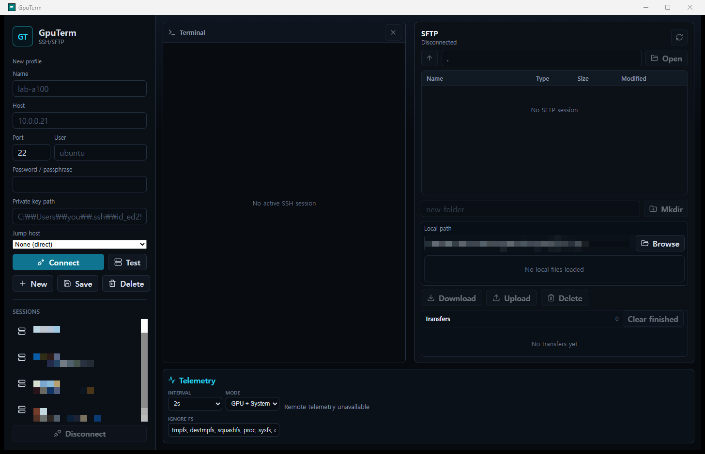

<div align="center">

# GpuTerm

**The all-in-one SSH/SFTP desktop client for GPU servers.**

Terminal, file transfers, and real-time CPU · RAM · Disk · GPU telemetry (NVIDIA / AMD / Intel / Apple Silicon) — in a single native window.

[](https://github.com/fortranmentis/GPUTERM/releases)
[](https://github.com/fortranmentis/GPUTERM/actions/workflows/release.yml)
[](https://github.com/fortranmentis/GPUTERM/releases)
[](./LICENSE)
[](https://tauri.app)
[](https://react.dev)
[](https://www.rust-lang.org)

[English](./README.md) · [한국어](./README.ko.md)



</div>

---

Working on a remote GPU box usually means juggling an SSH client, an SFTP tool, and a second terminal running `watch nvidia-smi`. **GpuTerm replaces all three.** Connect once and get an xterm.js terminal, a drag-and-drop SFTP browser, and a live telemetry bar that polls CPU, memory, disk, logged-in users, and every GPU on the host — NVIDIA, AMD, Intel, or Apple Silicon, on Linux, macOS, and Windows remotes alike — over its own SSH channel, so monitoring never blocks your shell.

Almost nothing ever touches your servers: every metric comes from one-shot standard commands (`nvidia-smi`, `/proc`, `sysctl`, PowerShell CIM, …) over SSH, and no admin/root rights are required for the core metrics. The [three narrow exceptions](#faq) are an oversized Windows collector script, the opt-in Claude status-line helper, and LLM runtime monitoring — which runs no remote command at all.

> **Status:** beta. Prebuilt installers for Windows, macOS, and Linux are attached to every [release](https://github.com/fortranmentis/GPUTERM/releases); you can also build from source below.

## Table of contents

- [Features](#features)
- [What you can monitor](#what-you-can-monitor)
- [Installation](#installation)
- [Usage](#usage)
- [Architecture](#architecture)
- [Development](#development)
- [FAQ](#faq)
- [Troubleshooting](#troubleshooting)
- [Roadmap / Known limitations](#roadmap--known-limitations)
- [License](#license)

## Features

### 🖥️ SSH Terminal
- Full PTY terminal powered by [xterm.js](https://xtermjs.org) and Rust [`ssh2`](https://crates.io/crates/ssh2)
- **Multiple concurrent sessions** — each keeps its own terminal, scrollback, and SFTP path; click a connected profile in the sidebar to switch
- **Up to four flexible terminal cells** — place a new shell or another saved session to the left, right, top, or bottom of the focused pane; choose its initial ratio and drag dividers to resize nested layouts
- **Collapsible host selector** — hide the sidebar for more workspace and reopen it from the top-left button; full profile fields appear only for **New**, while saved profiles show a connect-time credential prompt
- **ProxyJump** — tunnel through a saved profile as a bastion (per-key-type host verification along the way)
- **Native local terminal** — open the current machine without SSH and use the same terminal splits and monitoring UI
- Password, private key (with passphrase), and SSH agent authentication
- UTF-8 safe streaming — multibyte characters (한글, 日本語, emoji) survive chunked reads
- **CJK input works correctly** — Korean IME composition in the terminal is handled with the same backspace-rewrite protocol native terminals use, fixing the jamo-splitting bug in WebKit-based webviews
- **Scrollback search** — `Ctrl`/`Cmd`+`F` opens an in-pane find bar with match count, `Enter`/`Shift`+`Enter` to step through hits, `Escape` to return focus to the shell
- **Disconnect is visible and recoverable** — a pane whose shell or channel ends shows the reason the backend reported and a **Reconnect** button instead of silently refusing input
- MOTD and early output are buffered and replayed, never lost to connection races
- Serialized burst input plus a fully nonblocking SSH/TCP transport keeps simultaneous keys, modifier chords, and key repeat responsive without racing the terminal reader
- Terminal writes avoid libssh2's incoming-data flush path, while writes, remote PTY resize, and SSH keepalive retry nonblocking operations without packet interleaving
- Automatic remote PTY resize and SSH keepalive, including ProxyJump tunnels

### 📁 SFTP Browser
- Side-by-side remote/local panels with a draggable divider for adjusting their vertical ratio
- **Sortable remote columns** — click Name, Type, Size, or Modified; click again to reverse direction while folders stay first and missing metadata stays last
- **Decimal file sizes** — remote/local listings and transfer progress use consistent SI `B / KB / MB / GB / TB` units
- Drag-and-drop upload & download for **files and complete directory trees**, with aggregate folder progress and cancellation
- **Native desktop drops and paste uploads** — drag files/folders from Explorer, Finder, or Nautilus, or paste URI-list items into the remote pane
- **Native desktop drag-out** — drag remote files, complete folders, or multi-selections from GpuTerm into Finder, Explorer, or a Linux file manager
- **Platform-aware drag interop** — GTK file URIs remain available until Linux file managers finish reading them, while native macOS/Linux and Windows drop coordinates are normalized correctly on scaled displays
- Streaming 1 MiB chunked transfers with a progress queue and **per-item cancellation**
- Downloaded files are written to temporary files and atomically renamed — no partial files are exposed
- Replace/merge confirmation, delete, contextual mkdir beside Open, and a native OS folder picker
- Resizable split between terminal and SFTP panes (persisted across launches)
- **Collapsible SFTP panel** — close it with the directional panel button and restore it from the top-right; the terminal immediately expands into the freed width
- **Responsive narrow layout** — metadata columns collapse progressively and transfer controls remain accessible when the SFTP pane is resized to its minimum width

### 📊 Live Telemetry
- Bottom status bar polling CPU, RAM, disk, logged-in users, and GPUs every 1–10 s — on **local or remote Linux, macOS, and Windows hosts**
- **Collapsible monitoring bar** — close it independently and restore it from the bottom-right; visibility is remembered across launches
- **NVIDIA, AMD, Intel, and Apple Silicon** GPUs are auto-detected per host; every card carries a vendor tag
- **Hybrid iGPU + dGPU hosts show both cards** — Linux supplements vendor tools with DRM/sysfs adapter discovery, while Windows attributes counters by DirectX LUID and keeps idle adapters visible even before WDDM creates an activity counter
- **AI DASH for AGY, Codex, and Claude Code** — the bottom card shows every available 5-hour and weekly balance at once in compact gauges, while the detail view retains context, tokens, and aggregate CPU/RAM across each CLI's complete child-process tree. AGY uses the precise percentage printed beside each `/usage` bar, lists the models in each group, and plots their in-memory 24-hour trend
- **Cross-platform local AI quotas** — macOS Claude setup uses built-in `osascript` without Python; Windows Codex/AGY probes reuse observed native executables and support npm `.cmd` shims, while Windows Claude uses a consistent User Profile path
- **Bounded disk summaries** — long mount paths are ellipsized inside the card without hiding utilization, with the complete path available on hover
- Click any section for a **draggable, resizable detail popover** whose tables expand with the window: per-core CPU usage, top processes, VRAM/power/temperature per GPU, full mount list
- **Pop any detail view out into its own OS window** — it refreshes independently and closes with its session
- Remote telemetry runs on a dedicated SSH connection with automatic reconnect; local telemetry executes collectors directly without SSH
- **Quiet Windows local monitoring** — PowerShell collectors run without allocating console windows and emit UTF-8 text, so localized device and volume names remain parseable
- Hosts without any GPU gracefully fall back to system-only metrics

### 🤖 Ollama & vLLM runtime monitoring
- Register any number of **Ollama** and **vLLM** servers by URL; each is polled independently of your SSH sessions, so the card works with no terminal connected
- **Poll directly, or through an SSH tunnel** — pick a saved SSH profile as the instance's *Reach through* and the address is resolved on that host, so a runtime bound to its own `127.0.0.1` needs nothing exposed on the network
- **Read-only.** GpuTerm calls `/api/ps`, `/api/tags`, `/health`, `/v1/models`, and `/metrics` only. It never sends an inference request, downloads or deletes a model, or restarts a server
- **Ollama** — running and installed models, model size, VRAM-resident size and share, estimated non-VRAM residency, configured maximum context, and how long a loaded model stays in memory
- **vLLM** — running/waiting/swapped requests, server-wide KV cache usage and headroom, prefix-cache hit rate, prompt and generation tokens per second, request rate, preemptions, and TTFT/latency/queue percentiles interpolated from Prometheus histogram buckets
- **Nothing is faked.** A metric this build of the runtime does not publish is shown as *not supported*, and a value that has not been read yet is shown as `—`. Neither is ever displayed as `0`
- **Counter restarts are handled** — a counter that goes backwards produces a null rate for that interval and a "server was probably restarted" event, never a negative throughput
- API keys go straight into the encrypted `credentials.enc` vault. They are never returned to the webview, never written to `llm_instances.json`, and masked out of error text
- Per-instance poll interval and timeout, enable/disable, a connection test that saves nothing, exponential backoff on repeated failure, and a 15-minute in-memory trend chart

### 🔐 Security by default
- Passwords and key passphrases are stored only in the local `credentials.enc` vault: Argon2id derives a 256-bit key from your GpuTerm master password, and AES-256-GCM encrypts and authenticates the complete credential payload
- The master password and derived key are kept in memory only for the current app run; secrets are never written in plaintext or included in `sessions.json`
- Saved-session password fields show a secure mask while keeping the actual secret out of the webview; leaving the field blank reuses the vault entry
- Trust-on-first-use host key prompt with SHA-256 fingerprint; mismatches block the connection
- Restrictive Tauri Content Security Policy in production and development

> **Upgrading to 1.1.2-beta:** GpuTerm no longer accesses macOS Keychain, Windows Credential Manager, or Linux Secret Service/libsecret. Existing OS-vault entries are left untouched but are not imported; create a GpuTerm master password and enter each SSH password again after upgrading.

## What you can monitor

| Metric | Linux | macOS (Apple Silicon) | Windows (OpenSSH Server) |
| --- | :-: | :-: | :-: |
| CPU model · cores · usage | ✅ | ✅ (P/E core split) | ✅ |
| Load average | ✅ | ✅ | — (doesn't exist on Windows) |
| Memory + swap | ✅ | ✅ (Activity Monitor semantics) | ✅ (page file as swap) |
| Disks / mounts | ✅ | ✅ | ✅ (fixed drives) |
| Logged-in users | ✅ `who` | ✅ `who` | ✅ `quser` (absent on Home editions) |
| NVIDIA GPU (util · VRAM · power · temp · processes) | ✅ `nvidia-smi` | — | ✅ `nvidia-smi` |
| AMD GPU | ✅ `rocm-smi` (full) | — | ◐ WDDM counters (util + VRAM) |
| Intel GPU | ◐ `xpu-smi` / `intel_gpu_top` | — | ◐ WDDM counters (util + VRAM) |
| Apple GPU | — | ◐ util + memory (power/temp need root) | — |
| AGY · Codex · Claude Code process trees | ✅ `ps` | ✅ `ps` | ✅ CIM + `Get-Process` |
| Ollama / vLLM runtimes | ✅ HTTP | ✅ HTTP | ✅ HTTP |
| Detail popovers (per-core CPU, top processes) | ✅ | ✅ (no per-core without root) | ✅ |

✅ full support ◐ partial (see [known limitations](#roadmap--known-limitations)) — the exact remote commands are listed under [Usage](#usage).

## Installation

### Prebuilt installers

Download from the [latest release](https://github.com/fortranmentis/GPUTERM/releases):

| OS | File | Notes |
| --- | --- | --- |
| Windows 10/11 (x64) | `GpuTerm_x.y.z_x64-setup.exe` | NSIS installer |
| macOS (Apple Silicon) | `GpuTerm_x.y.z_aarch64.dmg` | Intel Macs: build from source for now |
| Debian / Ubuntu (x64) | `GpuTerm_x.y.z_amd64.deb` | `sudo apt install ./GpuTerm_*.deb` |

<details>
<summary>“Unknown publisher” / Gatekeeper warnings</summary>

Beta builds are not signed with a trusted publisher/developer identity or notarized, so your OS may warn on first launch. The macOS app bundle is fully ad-hoc signed inside-out (nested Mach-O code first, then the final application bundle) and verified for integrity before the DMG is published:

- **Windows** — SmartScreen shows *“Windows protected your PC”*: click **More info → Run anyway**.
- **macOS** — if Gatekeeper blocks the ad-hoc-signed app, right-click **GpuTerm.app → Open → Open**, or run `xattr -cr /Applications/GpuTerm.app` once.

The installers are built on GitHub Actions from the tagged source (see [Releases & CI](#releases--ci)), so you can always audit exactly what went into them — or build your own below.

After copying the app to `/Applications`, you can verify the sealed bundle yourself:

```bash
codesign --verify --deep --strict --verbose=2 /Applications/GpuTerm.app
```

</details>

### Build from source

**Prerequisites:** [Node.js](https://nodejs.org) ≥ 20, npm ≥ 10, [Rust](https://rustup.rs) stable, and the [Tauri prerequisites](https://tauri.app/start/prerequisites/) for your OS.

<details>
<summary>Per-OS prerequisite details</summary>

**Windows**
- Visual Studio Build Tools 2022 with the *Desktop development with C++* workload
- WebView2 Runtime (preinstalled on Windows 10/11)
- Git for Windows
- [Strawberry Perl](https://strawberryperl.com) (`winget install StrawberryPerl.StrawberryPerl`) — required to compile the vendored OpenSSL that backs the SSH library

**macOS**
```bash
xcode-select --install
```

**Linux (Debian/Ubuntu)**
```bash
sudo apt update
sudo apt install -y libwebkit2gtk-4.1-dev build-essential curl wget file \
  libxdo-dev libssl-dev libayatana-appindicator3-dev librsvg2-dev
```

</details>

```bash
git clone https://github.com/fortranmentis/GPUTERM.git
cd GPUTERM
npm install

# Run the desktop app in development mode
npm run tauri:dev

# Package a distributable build (output: src-tauri/target/release/bundle)
npm run tauri:build
```

> `npm run dev` starts the Vite frontend alone — useful for layout work, but SSH/SFTP/telemetry require the full Tauri app.

## Usage

1. **Unlock the local vault** — choose a GpuTerm master password on first launch; on later launches enter it once to unlock saved credentials for that app run.
2. **Create a profile** — enter host, port, username, and a password or private key path in the sidebar. Press **New** to start a fresh profile, **Save** to keep it. To route through a bastion, pick any saved profile as the **Jump host**.
3. **Connect** — on first contact GpuTerm shows the server's SHA-256 host key fingerprint and asks for confirmation before trusting it. Connect as many servers as you like; connected profiles show a green dot, and clicking one switches the whole view to that session.
4. **Split terminals** — use the columns button to open another shell for the focused session, or the **+** button to add a different saved session. Choose left/right/top/bottom placement and the new pane's initial size before adding it.
5. **Work** — type in the terminal, drag or paste files into the remote SFTP panel, and watch live metrics in the bottom bar. Click CPU / RAM / Disk / GPU / Users for detail popovers you can drag around, resize, or pop out into separate windows with the ↗ button.
6. **Register an LLM runtime (optional)** — click **LLM RUNTIME** in the monitoring bar, then **Add**. This card is not tied to a session, so it works before you connect anything.

<details>
<summary>Terminal split controls</summary>

- The **columns** button opens another independent PTY shell for the currently focused session.
- The **+** button lists saved profiles. A live session is added immediately; a disconnected profile asks for its password/key passphrase (and jump-host password when applicable) before connecting.
- Up to four cells can be nested horizontally and vertically. Choose a 20–80% initial size, then drag any divider to adjust the ratio. Each mixed-session cell displays its profile name.
- Clicking a cell makes that session active for SFTP and telemetry while preserving the split layout. The cell's **×** button closes that terminal pane.

</details>

<details>
<summary>Workspace panel controls</summary>

- The host selector, SFTP browser, and monitoring bar each have a directional close button in their header.
- Reopen a hidden panel from its matching workspace edge: host selector at the top-left, SFTP at the top-right, and monitoring at the bottom-right.
- Each panel's open/closed state is saved locally. Hiding SFTP expands terminal width; hiding monitoring expands terminal height.

</details>

<details>
<summary>SFTP transfer details</summary>

- Drop multiple files or folders at once; each top-level item becomes an independent queue item with progress, status, and error reporting. Folder contents are transferred recursively.
- Running transfers can be canceled individually from the queue.
- If the target exists, GpuTerm asks before replacing a file or merging into an existing folder.
- Files and folders dragged from Explorer, Finder, or Nautilus use the native desktop path payload; items copied in Nautilus and compatible file managers can also be pasted into the focused remote pane.
- To export remote items to another application, drag them toward a GpuTerm window edge. GpuTerm materializes them in a temporary local export and then starts a native OS copy drag. Large items may finish preparing after the pointer is released; drag them again once the transfer queue reports completion.
- On Linux, GpuTerm keeps the GTK `text/uri-list` provider alive until the native drag has ended so Nautilus and other file managers can complete their asynchronous file request. On Retina/scaled displays, native drop coordinates are converted per platform before the remote pane is selected.
- Click a local folder once to select it for transfer and double-click it to open it. The divider between the remote and local lists can be dragged or adjusted with the arrow keys.
- Click a remote column header to sort it. Name/Type start ascending, Size/Modified start descending, repeated clicks reverse the direction, and the current sort remains active while navigating or refreshing.
- At narrow SFTP widths, Modified and then Type are hidden automatically; Browse and transfer actions switch to icon-only controls with accessible labels rather than overflowing the pane.
- Symbolic links are rejected during recursive transfer to prevent cycles and unexpected traversal outside the selected tree.
- The last local directory is remembered across launches.

</details>

<details>
<summary>Telemetry configuration</summary>

- **Interval:** 1, 2 (default), 5, or 10 seconds — detail popovers poll on the same cadence.
- **Mode:** GPU + System, GPU only, or System only.
- **Ignore FS:** comma-separated filesystem types hidden from the disk summary (default: `tmpfs`, `devtmpfs`, `squashfs`, `proc`, `sysfs`, `cgroup`, `cgroup2`, `overlay`, `devfs`, `autofs`). The disk popover can temporarily reveal them.
- Mount points are prioritized `/` → `/home` → `/data` → `/mnt*` → `/media*` → drive letters → others; disks ≥ 80% are flagged warning, ≥ 90% critical. Long compact-card paths are ellipsized, and their full value remains available as hover text and in the disk detail view.
- **AI DASH:** the System modes include a 360 px summary card for AGY, Codex, and Claude Code. Its thin two-column gauges show every available 5-hour and weekly balance simultaneously; unsupported periods show `n/a`, expired windows show `reset`, and warning colors start at 25% and 10% remaining. Duplicate sessions share the newest account snapshot. The detail view keeps context and token data collapsed and includes descendants such as language servers, subagents, and background commands in CPU/memory totals. Codex uses account-wide `account/rateLimits/read` and labels its session-log fallback. Claude Code limits come from [Claude Code usage limits](#claude-code-usage-limits). AGY experimentally reads `/usage` in a hidden PTY every five minutes, preserves the Gemini and Claude/GPT model groups, and plots successful and failed samples over the last 24 hours without estimating missing balances.

</details>

<details>
<summary>Connecting an Ollama or vLLM server</summary>

Both are configured the same way: **LLM RUNTIME → Add**, pick the runtime, enter the address, and press **Test connection** before **Add**. Only `http` and `https` addresses are accepted; a trailing `/`, a path, or a query string is stripped, so `http://host:11434/` and `http://host:11434` are the same instance. The same runtime cannot be registered twice at the same address.

**Ollama** — the default address is `http://<host>:11434`. Ollama binds to `127.0.0.1` unless told otherwise, so to monitor it from another machine either start it with `OLLAMA_HOST=0.0.0.0:11434` (or set that in the service unit) and open the port, or leave it on loopback and use the SSH tunnel described below. No API key is needed. GpuTerm reads `/api/ps` every poll and `/api/tags` every five minutes.

**vLLM** — the default address is `http://<host>:8000`, i.e. the `--host`/`--port` given to `vllm serve`. If the server was started with `--api-key`, enter the same value in the **API key** field; GpuTerm sends it as `Authorization: Bearer …` on every request and stores it in the encrypted vault. `/metrics` is enabled by default; if the server runs with `--disable-log-stats` it publishes no serving metrics and GpuTerm reports them as unavailable rather than zero. GpuTerm reads `/health` and `/metrics` every poll and `/v1/models` every minute.

For an `https` address, the certificate is validated against the operating system trust store, so an internal CA already trusted by the machine works without extra configuration.

**Or leave the runtime on loopback and tunnel over SSH.** Set **Reach through** to a saved SSH profile instead of `Direct`. The address is then resolved *on that host*, so `http://127.0.0.1:11434` reaches a runtime bound to the remote machine's own loopback — no `0.0.0.0` binding, no firewall rule, no `netsh portproxy`, and the traffic is carried inside SSH. GpuTerm opens one SSH connection per profile (shared by every tunneled instance on that host) and forwards one loopback port per instance.

Two things to know before choosing it:

- The SSH host key must already be trusted. Press **Test connection** once — that is the only place the fingerprint prompt can appear, because the background poller has no way to ask. After trusting it, monitoring starts on its own within one poll interval.
- The forwarded loopback port stays open for as long as the app runs, and any process on your own machine can reach the remote runtime through it. This is exactly what `ssh -L` does and no worse, but it is a real difference from polling a LAN address.

`https` cannot be tunneled: the request would arrive at `127.0.0.1`, so the certificate would be checked against that address and could not match. GpuTerm refuses the combination when you save it rather than failing later.

</details>

<details>
<summary>Metrics no runtime reports, and why</summary>

| Not shown | Why |
| --- | --- |
| Ollama request count, queue depth, TTFT, tokens/s | `/api/ps` and `/api/tags` do not expose them. The per-request figures exist only in an inference response, and GpuTerm never sends an inference request |
| Ollama current context usage | Only the configured maximum is published. It is labeled *configured max context* for that reason |
| vLLM `num_requests_swapped` | Removed in newer vLLM. Shown as *not supported*, never as `0` |
| vLLM percentiles when the histogram is absent | Some builds omit `_bucket` series or use `--disable-log-stats`. Percentiles are left blank rather than invented |
| Ollama non-VRAM residency as RAM | `size - size_vram` is an estimate of CPU offloading, not a measurement of system RAM, and is labeled as such |

</details>

<details>
<summary>Remote commands executed for telemetry</summary>

All metrics come from standard tools over SSH — nothing is installed on the server.

| Section | Linux | macOS | Windows |
| --- | --- | --- | --- |
| CPU | `/proc/stat`, `/proc/loadavg`, `/proc/cpuinfo`, `nproc`, `lscpu` | `sysctl` (brand, cores, P/E split, loadavg), `top -l 2` | `Win32_Processor`, `Win32_PerfRawData_PerfOS_Processor` (CIM) |
| Memory | `/proc/meminfo` | `sysctl hw.memsize`, `vm_stat`, `vm.swapusage` | `Win32_OperatingSystem`, `Win32_PageFileUsage` (CIM) |
| Disk | `df -P -T -B1` | `df -P -k` + `mount` | `Win32_LogicalDisk` (fixed drives) |
| Users | `who` | `who` | `quser` |
| GPU | `nvidia-smi` (NVIDIA), `rocm-smi --json` (AMD/ROCm), `xpu-smi` / `intel_gpu_top` (Intel), plus `/sys/class/drm/card*/device` for uncovered adapters | `ioreg -c IOAccelerator` (Apple GPU utilization, no root needed) | `nvidia-smi` (NVIDIA, full metrics); WDDM GPU performance counters for AMD/Intel (utilization + VRAM) |
| Top processes | `ps -eo … --sort=-%cpu` / `--sort=-rss` | `ps -Ao … -r` / `-m` | `Get-Process` (two-sample CPU delta) |
| AI DASH | `ps -axo …`; provider metadata; Codex app-server quota lookup; optional AGY `/usage` PTY probe | same | `Win32_Process` + `Get-Process`; provider metadata, Codex account lookup, and optional AGY `/usage` ConPTY probe |

LLM runtime monitoring is the exception: it runs no remote command at all. GpuTerm issues HTTP GETs from the desktop machine to the addresses you register — `/api/ps` and `/api/tags` for Ollama, `/health`, `/v1/models`, and `/metrics` for vLLM — and nothing else.

Commands run with a 3-second timeout on a dedicated SSH connection (10 s on Windows to absorb PowerShell start-up); Codex account reads use 5 seconds and the experimental AGY PTY probe uses 15 seconds. Windows commands are batched into a single PowerShell 5.1 invocation per poll and work with either cmd.exe or PowerShell as the OpenSSH default shell. Small scripts travel as `-EncodedCommand`; larger ones are uploaded over SFTP under a content-addressed name and run with `-File`, because base64 of UTF-16LE inflates a script by roughly 2.7x while cmd.exe — the OpenSSH default shell for exec requests — stops at 8,191 characters. Uploaded scripts live under `~/.gputerm/scripts`, are re-sent only when their contents change, and are pruned after seven days; nothing is installed and no admin rights are required. For a local Windows session, the same collectors use the system PowerShell directly with `CREATE_NO_WINDOW` and explicit UTF-8 text output, preventing polling consoles from appearing and preserving localized JSON fields. GpuTerm detects the remote OS and available GPU tools per host and shows a vendor tag on every card; `intel_gpu_top` needs root or `CAP_PERFMON`, and Apple GPU power/temperature would need root `powermetrics`, so they show as n/a. Linux DRM/sysfs supplies adapter identity and any driver-exported utilization/VRAM counters for GPUs not covered by a richer vendor collector. If no GPU source is present, the GPU section reports unavailable while everything else keeps working.

AI DASH monitoring is read-only except when the user explicitly presses Claude's **Set up** button. Process totals are collected every telemetry interval and session metadata at most every five seconds. Account quotas are kept separately from session context: every live session for one provider receives the same newest account snapshot. Codex queries `account/rateLimits/read` at most once per minute and falls back to the newest timestamped session-log record if the app-server lookup fails. While AGY is running, GpuTerm waits for a hidden PTY to become ready, sends `/usage` exactly once on first detection and then at most once per five minutes, and never sends a plain `usage` command. The precise bar percentage takes precedence over the rounded `remaining` line; model membership and reset countdowns are also normalized. GpuTerm keeps one point per five-minute bucket for the latest 24 hours (maximum 288) in memory only; reconnects in the same app run share that history, failures create visible graph gaps, and app exit discards it. Raw terminal output is discarded after parsing. Prompts, responses, tool arguments, credentials, and environment data are never serialized.

</details>

### Claude Code usage limits

Claude Code never writes its 5-hour and 7-day usage limits to a session transcript — the status-line hook is the only place it publishes them. GpuTerm ships a status line that republishes that data for AI DASH and prints a usable status line of its own:

The easiest setup is **AI DASH → Claude Code → Set up**. GpuTerm backs up `settings.json`, installs the helper on that local or SSH host, and never replaces an unrelated custom status line. The commands below remain available for manual POSIX setup.

```bash
cp scripts/gputerm-claude-statusline.sh ~/.claude/gputerm-claude-statusline.sh && chmod +x ~/.claude/gputerm-claude-statusline.sh
```

Then add it to `~/.claude/settings.json`:

```json
{
  "statusLine": {
    "type": "command",
    "command": "~/.claude/gputerm-claude-statusline.sh",
    "padding": 0
  }
}
```

The status line prints `Opus · ctx 8% · 5h 76% · wk 59% · $0.12`. It writes `~/.cache/gputerm/agent-status/claude/<session-id>.json` for that session, and — whenever the payload actually carries limits — refreshes `~/.cache/gputerm/agent-status/claude/account.json` with the account-wide 5-hour and weekly windows. GpuTerm always reads `account.json` by name, so a burst of short-lived sessions writing quota-less snapshots cannot hide the only useful reading. Install the status line on every host you want to monitor, including remote ones. Automatic macOS setup installs a JavaScript for Automation helper that uses the built-in `osascript`, so Python is not required. Automatic Windows setup installs `gputerm-claude-statusline.ps1` and registers an absolute, forward-slash path through `powershell.exe`, so it works whether Claude Code chooses Git Bash or PowerShell. Windows PowerShell 5.1 is built into supported Windows versions; Python is not required for the Windows helper.

Remote setup transfers the helper over SFTP rather than embedding it in a shell command, and every write goes through a temporary sibling that is unlinked-and-renamed into place (libssh2 pins SFTP to version 3, where a rename cannot overwrite an existing path). Embedding could not work reliably: macOS/BSD `base64` rejects a positional input file, and the Windows PowerShell form reached roughly 23,000 characters on the wire against cmd.exe's 8,191-character limit, which is what Windows OpenSSH uses for exec requests unless an administrator changed `DefaultShell`. Both the helper and `settings.json` are written through a temporary sibling and renamed into place, so a failed setup can never leave an empty helper where a working one was. A UTF-8 BOM in `settings.json`, which Windows editors and PowerShell redirection both write, is tolerated.

Only these fields are written: session id, working directory, model name and id, `context_window` (including `current_usage`), `cost.total_cost_usd`, `cost.total_duration_ms`, `rate_limits.{five_hour,seven_day}.{used_percentage,resets_at}`, a capture timestamp, and the agent pid when available. Prompts, responses, tool input and output, transcript paths, session names, and repository details are never copied. Snapshots older than seven days are pruned on the next run.

Two conditions come from Claude Code itself: `rate_limits` is present for subscription accounts only, and it appears after the session's first response. Rather than guessing a balance, the card names the step that is actually blocking — helper missing, helper present but empty, no status line configured, a different status line in the way, or installed and waiting for the first message.

## Architecture

```
┌───────────────────────────── Tauri window ─────────────────────────────┐
│  React 19 + TypeScript + Zustand + xterm.js                            │
│    invoke() ──────────────► Tauri commands (Rust)                      │
│    listen() ◄────────────── terminal-output · remote-telemetry ·       │
│                             llm-runtime-telemetry · sftp-progress ·    │
│                             terminal-closed                            │
├────────────────────────────────────────────────────────────────────────┤
│  Rust backend (ssh2 / libssh2)                                         │
│    • Terminal      – PTY shell, dedicated connection per terminal cell │
│    • Telemetry     – own connection, auto-reconnect with backoff       │
│    • SFTP ops      – pooled per-session "operations" connection        │
│    • Bulk transfer – dedicated connection per item, recursive/cancellable│
│    • LLM runtimes  – session-independent HTTP poller (ureq), one thread│
│                      per instance, read-only; optionally over an SSH   │
│                      direct-tcpip forward                              │
└────────────────────────────────────────────────────────────────────────┘
```

Long-running work is isolated: blocking SSH I/O runs on `spawn_blocking` threads so the UI never freezes, and each concern (shell / telemetry / transfers) fails independently.

**Data locations** (`%APPDATA%\GpuTerm` on Windows, `~/Library/Application Support/GpuTerm` on macOS, `~/.config/GpuTerm` on Linux):

| Location | Contents |
| --- | --- |
| `sessions.json` | Session profiles — host, port, username, key *path* only |
| `known_hosts.json` | Approved SHA-256 host key fingerprints |
| `app_settings.json` | UI preferences such as the last local SFTP directory |
| `credentials.enc` | Versioned Argon2id parameters plus an AES-256-GCM encrypted and authenticated credential payload |
| `credential_index.json` | Non-secret session ids used only to show which profiles have a saved vault entry |
| `llm_instances.json` | Registered Ollama/vLLM instances — name, runtime, URL, poll interval, optional SSH tunnel profile id. Never the API key |

Passwords and key passphrases are **never written in plaintext**. Private key contents are never copied into GpuTerm's configuration files.

## Development

```bash
npm run test                                    # frontend tests (Vitest)
npm run typecheck                               # TypeScript, no emit
npm run lint                                    # ESLint (React hooks rules)
cargo test --manifest-path src-tauri/Cargo.toml # backend tests
cargo clippy --manifest-path src-tauri/Cargo.toml --all-targets -- -D warnings  # lints
npm run build                                   # TypeScript + Vite production build
```

`.github/workflows/ci.yml` runs all of the above on every push and pull request, plus a `cargo check` against the MSRV declared in `src-tauri/Cargo.toml`.

<details>
<summary>Project layout</summary>

```
src/                    React frontend
  components/           TerminalPane, SftpBrowser, RemoteTelemetryBar, popovers…
  stores/               Zustand stores (session, transfers)
  utils/                Shared formatters, terminal buffer, disk priority,
                        WebKit Hangul IME workaround
src-tauri/src/ssh/      Rust backend
  terminal.rs           PTY shell + UTF-8 safe reader
  system_monitor.rs     Telemetry loop, OS detection, Linux parsers
  agent_monitor.rs      Agent process trees + read-only session metadata
  macos_monitor.rs      macOS collectors (sysctl, vm_stat, ioreg)
  windows_monitor.rs    Windows collectors (PowerShell CIM, WDDM GPU counters)
  gpu_monitor.rs        GPU tool probing + vendor parsers
  resource_details.rs   On-demand CPU/RAM/GPU detail collection
  sftp.rs               Transfers, cancellation, SFTP commands
  session.rs            Connections, host keys, profiles, connection pool
```

</details>

### Releases & CI

Pushing a `v*` tag runs the [Release Build workflow](.github/workflows/release.yml), which creates the prerelease from [RELEASE_NOTES.md](./RELEASE_NOTES.md), builds the Windows `.exe` (NSIS), Debian `.deb`, and macOS `.dmg` on GitHub-hosted runners, and attaches them to the tag. The macOS job signs every nested code object inside-out, deep-signs and verifies the final app, builds the DMG from that verified bundle, mounts it, and verifies the enclosed app again. A `SHA256SUMS.txt` file is published after all three installers succeed. The workflow can also be dispatched manually for an existing tag from the Actions page.

## FAQ

<details>
<summary><b>Does GpuTerm install anything on my servers?</b></summary>

Almost never, and never without you asking. Every metric comes from one-shot, read-only standard commands over SSH (`nvidia-smi`, `cat /proc/...`, `sysctl`, PowerShell `Get-CimInstance`, …). There are three exceptions, all narrow:

- **LLM runtime monitoring runs no remote command at all.** It issues HTTP GETs from your machine to the addresses you register. With an SSH tunnel it opens a forwarded channel, still without executing anything on the host.
- **Windows AI DASH may upload a collector script.** When a PowerShell command exceeds the `cmd.exe` command-line limit, GpuTerm writes a content-addressed `.ps1` under the connected user's `~/.gputerm/scripts` and runs it with `-File`. Those files contain only GpuTerm's collector code — no credentials, no collected output — and are pruned after seven days without use.
- **Claude Code quota monitoring installs a status-line script, but only when you press Set up.** It writes `gputerm-claude-statusline.*` into `~/.claude` on the monitored host so Claude can publish its own limits. Nothing else is copied, and no other metric depends on it.

</details>

<details>
<summary><b>Where are my passwords stored?</b></summary>

Passwords and key passphrases are stored in `credentials.enc`. GpuTerm derives a 256-bit key from your master password with Argon2id (64 MiB, 3 iterations) and encrypts the complete payload with AES-256-GCM and a fresh random nonce on every write. The master password and key are kept only in memory for the current run; `sessions.json` contains host metadata and the *path* to a private key, never a secret. Deleting a profile also deletes its vault entry.

Older Keychain/Credential Manager/Secret Service entries are not imported or accessed. After upgrading, enter each SSH password again. If you forget the master password, reset the vault; profiles remain, but saved passwords must be entered again. See the [data locations](#architecture) table.

</details>

<details>
<summary><b>Do I need root/admin on the remote host?</b></summary>

No for all core metrics. A few extras need elevation and simply show n/a without it: per-core CPU and GPU power/temperature on macOS (`powermetrics`), process owners on Windows, and `intel_gpu_top` on Linux (root or `CAP_PERFMON`).

</details>

<details>
<summary><b>Which remote OSes are supported?</b></summary>

Linux, macOS (Apple Silicon included), and Windows with OpenSSH Server — see the [support matrix](#what-you-can-monitor). The remote OS is auto-detected per connection; WSL counts as Linux, and MSYS/Cygwin/Git-Bash shells on Windows are correctly detected as Windows.

</details>

<details>
<summary><b>Why does my OS warn me when installing?</b></summary>

Beta installers do not carry a trusted publisher/Developer ID signature or Apple notarization. The macOS bundle is fully ad-hoc signed for integrity, but this does not establish publisher trust. See the [installation warning](#installation) for the one-time SmartScreen/Gatekeeper steps, or build from source.

</details>

<details>
<summary><b>Can I use GpuTerm at work / in a commercial product?</b></summary>

GpuTerm is free for personal and noncommercial use under [PolyForm Noncommercial 1.0.0](./LICENSE). Commercial use (including shipping paid products built on this source) is not permitted under that license — contact the maintainer about a commercial license.

</details>

## Troubleshooting

| Symptom | Check |
| --- | --- |
| SmartScreen / Gatekeeper blocks the app | Expected for a beta without a trusted publisher signature/notarization — see the [installation warning](#installation) |
| `tauri:dev` fails on Windows | VS Build Tools 2022 (C++ workload) + WebView2 Runtime installed, then restart the terminal |
| `cargo` not found | Install via [rustup](https://rustup.rs), reopen the terminal (`%USERPROFILE%\.cargo\bin` on PATH) |
| SSH auth fails | Verify host/port/user/credentials; confirm the server allows the auth method |
| Pressing multiple keys shows `Terminal stream failed: transport read` | Re-download v1.1.3-beta: the refreshed installers remove the destructive SSH channel flush and serialize nonblocking input, PTY resize, and keepalive operations |
| Master password is rejected or forgotten | Check the password, or choose **Reset vault**. Profiles are kept, but all saved SSH passwords are deleted and must be entered again |
| Host key mismatch | Verify the server fingerprint out-of-band, then remove the stale entry from `known_hosts.json` |
| GPU shows unavailable | Confirm a GPU tool is installed (`nvidia-smi`, `rocm-smi`, `xpu-smi`, or `intel_gpu_top`) or Linux `/sys/class/drm` is readable; other metrics still work regardless |
| Hybrid Windows PC only shows the dGPU | Update to the latest build. Idle Intel/AMD adapters are now retained from `Win32_VideoController` even when WDDM has not created a GPU Engine counter instance yet |
| AI DASH card is empty | Confirm `agy`, `codex`, or `claude` is running under a user visible to the telemetry account. CPU/RAM appears from the process tree; AGY token/context metadata additionally needs `python3` or `python` on the monitored host |
| Windows Claude setup succeeds but limits stay `n/a` | Run **Set up** again to replace the older `%USERPROFILE%` Python command, restart Claude Code, accept workspace trust, and send one message. Claude publishes subscription limits only after its first response |
| Local Windows session flashes console windows or has no monitoring data | Fixed in v1.1.6-beta — update the app; local PowerShell collectors now run without a console and use UTF-8 output |
| Windows remote shows “The system cannot find the path specified” | Fixed in v1.0.9-beta — older builds misdetected Windows hosts that have a `uname` port on PATH as Linux; update the app |
| Korean input splits into jamo in the terminal | Fixed for macOS/WebKit clients — update to the latest release |
| LLM instance shows `connection refused` at `127.0.0.1` | Check **Reached through** on its detail card. `Direct` means *this* machine's loopback; if the runtime is on another host, press **Edit** and set **Reach through** to that host's SSH profile |
| LLM instance shows `SSH host key not trusted` | Press **Test connection** on that instance once and accept the fingerprint, or open the same SSH session in a terminal. The background poller cannot show the prompt itself; monitoring resumes automatically afterwards |
| vLLM metrics are all *not supported* | The server is probably running with `--disable-log-stats`, which publishes no `/metrics`. Restart it without that flag |

## Roadmap / Known limitations

- Keyboard-interactive SSH authentication is not implemented
- Interrupted transfer resume is not implemented
- `known_hosts.json` uses SHA-256 fingerprints, not the OpenSSH known_hosts format
- Telemetry supports local and remote Linux, macOS (Apple Silicon included), and Windows hosts; Apple GPU power/temperature and per-core CPU usage need root `powermetrics` and are not shown
- GPU monitoring uses `nvidia-smi`, `rocm-smi`, `xpu-smi`, `intel_gpu_top`, Linux DRM/sysfs, macOS `ioreg`, or Windows WDDM performance counters; DRM shared-memory GPUs may expose utilization without dedicated VRAM, power, or temperature
- Agent CPU/RAM/process-tree totals are always available when the CLI process is visible to the monitoring user. AGY 1.0 token/context metadata needs Python 3 on the monitored host; AGY live quota/work state, Claude cost/subscriber limits, and provider-specific fields remain best effort because CLI log/status schemas vary. Unavailable fields show as n/a
- Windows remotes: requires Windows PowerShell 5.1+ (preinstalled); load averages don't exist and show as n/a; AMD/Intel GPUs report utilization and dedicated VRAM only (no power/temperature, needs Windows 10 1709+ with a WDDM 2.x driver); process owners and GPU process command lines need elevation and fall back to n/a / process names; `quser` is missing on Home editions, so the Users section stays empty there; hybrid iGPU+dGPU hosts show both cards (counters are attributed by adapter LUID from the DirectX registry, idle adapters remain visible without an activity counter, and a positional heuristic is used if the key is unavailable)
- LLM runtime monitoring is read-only and endpoint-based: models are not downloaded, deleted, started, or stopped, servers are not restarted, and no inference request is ever sent. Ollama therefore has no request, queue, TTFT, or tokens/s figures at all, and vLLM metrics depend on the version — anything the server does not publish is reported as *not supported* rather than as `0`
- LLM time series are kept in memory for one hour and are not written to disk, so they start empty after a restart
- An SSH-tunneled LLM instance needs its host key trusted first (via **Test connection** or by opening that session in a terminal once), because a background poller cannot show the fingerprint prompt. Its forwarded loopback port is reachable by any local process for as long as the app runs — the same exposure as a hand-run `ssh -L`. `https` cannot be tunneled, since the certificate would be validated against `127.0.0.1`
- macOS installer currently targets Apple Silicon only (Intel Macs: build from source)

Issues and pull requests are welcome — please run the test suites above before submitting.

## License

[PolyForm Noncommercial 1.0.0](./LICENSE) © GpuTerm contributors. **Free for personal and noncommercial use; commercial use is not permitted** — see the [license](./LICENSE) or contact the maintainer for a commercial license. Built with [Tauri](https://tauri.app), [React](https://react.dev), [xterm.js](https://xtermjs.org), and [ssh2](https://crates.io/crates/ssh2); those third-party components remain under their own (open-source) licenses.
